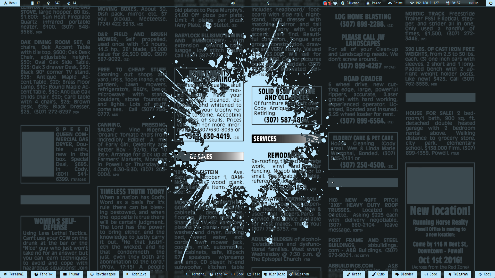
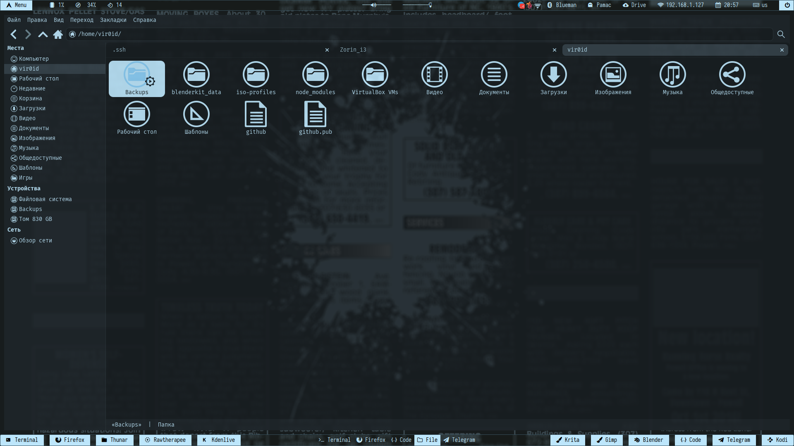
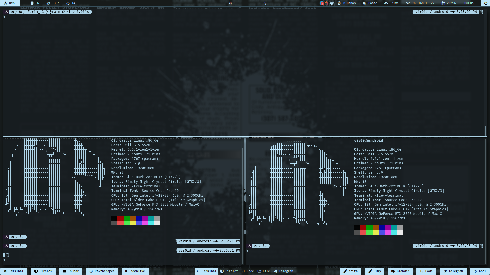

$${\color{lightgreen}Необходимые \space условия \space путей, \space для \space корректной \space работы.}$$

1. Нужно закинуть polybar rofi scripts и файл "config" в ~/.config/i3/ (polybar и rofi должны быть установлены)
2. Файл picom.conf должен находиться в ~/.config/ (picom должен быть установлен)
3. Папку с иконками (Simply-Night-Crystal-Circles) нужно закинуть в ~/.icons
4. Папку с темами (Blue-Light-ZorinGTK) нужно закидывать в ~/.themes

$${\color{red}!! ВАЖНО !!}$$
В случае, если вам не нужны изменения своих конфигураций i3, тогда "config" файлик (мой) закидывать не нужно.
В случае, если у вас расположение polybar и rofi находятся в другом месте ~/, и вы не хотите их менять, тогда вам нужно менять путь во всех моих файлах.

5. Найти и установить шрифт [Iosevka Term](https://github.com/be5invis/Iosevka)

6. Сделать записти в свой текущий i3/config. В случае земены config файла своего на мой, эти записи делать не нужно.

> exec_always --no-startup-id "$HOME/.config/i3/polybar/Zorin/launch.sh"

> exec --no-startup-id "picom -b --config ~/.config/picom.conf"

7. Установить обоину куда вам нужно

8. Перезапустить i3

$${\color{lightgreen}Управление \space окнами \space в \space случае \space замены \space config.}$$

В моем случае используется xfce4-terminal.

1. Закрыть окно
> mod+q

2. Открыть appmenu
> mod+d

3. Переключиться на рабочее простронство
> mod+[1-9]

4. Передвинуть окно на рабочее пространство
> mod+shift+[1-9]

5. Разделение окон по вертикали
> mod+h

6. Разделение окон по горизонтали
> mod+v

7. Перезапустить i3
> mod+sift+r

8. Открыть терминал (xfce4-terminal)
> mod+Enter

9. Сделать окно плавающим и обратно
> moc+c

10. Управление закладками окон
> mod+t
> mod+y
> mod+u

11. Полноэкранный режим окна и обратно
> mod+f

.
.
.