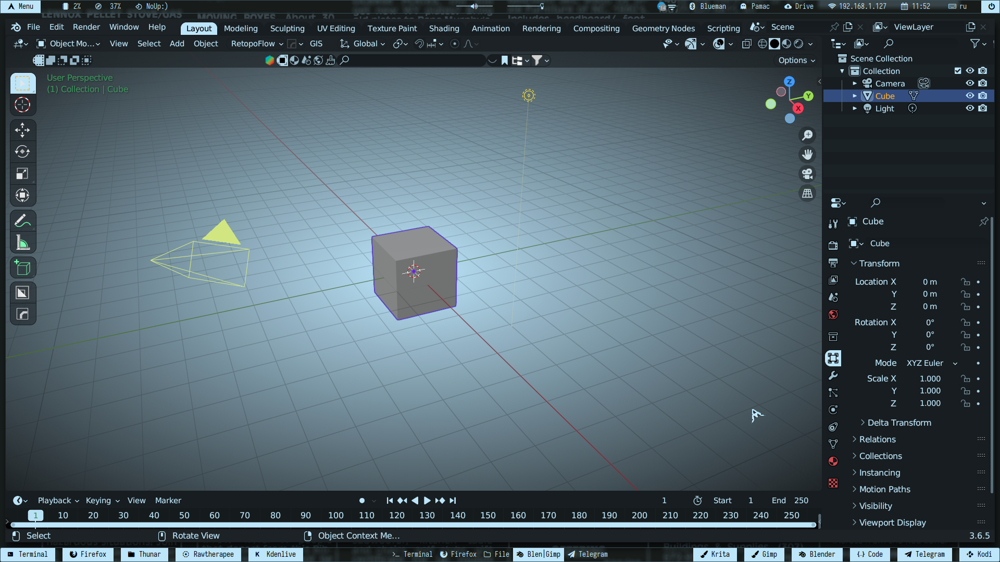

$${\color{lightgreen}Необходимые \space условия \space путей, \space для \space корректной \space работы.}$$

1. Нужно закинуть polybar, rofi, scripts, bin и файлик "config" в ~/.config/i3/ 
> polybar и rofi уже должны быть установлены в вашей системе
2. Файл picom.conf должен находиться в ~/.config/ 
> picom уже должен быть установлен в вашей системе
3. Папки с иконками (Simply-Night-Crystal-Circles и курсор ArchTrixCrystal) нужно закинуть в ~/.icons
4. Папку с темой (Blue-Light-ZorinGTK) нужно закидывать в ~/.themes

$${\color{red}!! ВАЖНО !!}$$
В случае, если вам не нужны изменения своих конфигураций i3, тогда "config" файлик (мой) и папку bin закидывать не нужно.
В случае, если у вас расположение polybar и rofi находятся в другом месте ~/, и вы не хотите их менять, тогда вам нужно менять путь во всех моих файлах.

5. Найти и установить шрифт [Iosevka Term](https://github.com/be5invis/Iosevka)

6. Найти и установить [ohmyposh](https://ohmyposh.dev/docs/installation/linux). Не обязательно, если вы не хотите. Но внешний вид терминала, у вас, может быть другим.

7. Установить [autotiling](https://github.com/nwg-piotr/autotiling)

> Для Arch-based дистрибутивов есть пакет autotiling в AUR

```python
yay -S autotiling
```

8. Сделать записи в свой текущий i3/config. В случае земены config файла своего на мой, эти записи делать не нужно.


```python
exec_always --no-startup-id "$HOME/.config/i3/polybar/Zorin/launch.sh"
```

```python
exec --no-startup-id "picom -b --config ~/.config/picom.conf"
```

9. Установить обоину куда вам нужно

10. Перезапустить i3

$${\color{red}!! ВАЖНО !!}$$
В любом случае, все модули polybar, которые присутствуют у меня, дожны быть настроены в соответствии с вашими желаниями и вашей машиной.


$${\color{lightgreen}Управление \space окнами \space в \space случае \space замены \space config.}$$

В моем случае используется xfce4-terminal. Скриншотка Kazam

1. Закрыть окно

```python
mod+q
```

2. Открыть appmenu

```python
mod+d
```

3. Переключиться на рабочее простронство [1-9]

```python
mod+[1-9]
```

4. Передвинуть окно на рабочее пространство [1-9]

```python
mod+shift+[1-9]
```

5. Разделение окон по вертикали

```python
mod+h
```

6. Разделение окон по горизонтали

```python
mod+v
```

7. Перезапустить i3

```python
mod+sift+r
```

8. Открыть терминал (xfce4-terminal)

```python
mod+Enter
```

9. Сделать окно плавающим и обратно

```python
moc+c
```

10. Управление закладками окон

В строку:
```python
mod+t
```

В столбик:
```python
mod+y
```

Разделить:
```python
mod+u
```

11. Полноэкранный режим окна и обратно

```python
mod+f
```

12. Скриншот экрана

```python
Print
```

$${\color{lightgreen}Что \space еще \space ?}$$

1. Еще есть тема оформления для blender. Папка соответствующая.
```python
~/.config/blender/Ваша версия/config/colorshemas/
```

2. Тему ohmyposh(Zorin.omp.json) можно скинуть в папку ~/.poshthemes/

   Затем отредактировать ваш .zshrc добавив строку в самый низ

```python
eval "$(oh-my-posh init zsh --config ~/.poshthemes/Zorin.omp.json)"
```

